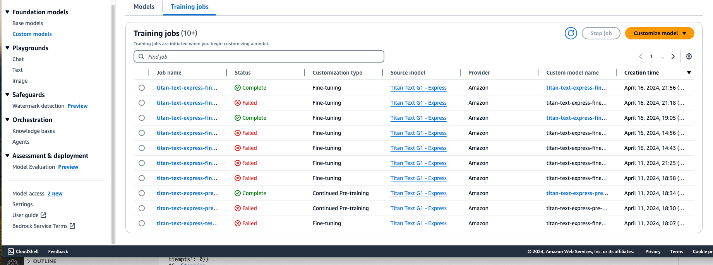
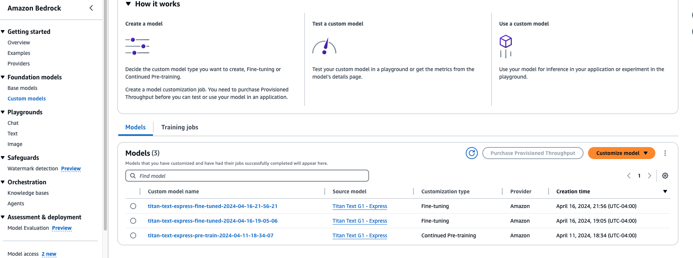

## Quickstart POC to create fine-tuned and pre-trained models in Amazon Bedrock

## **Goal of this Repo:**
The quickstart notebooks helps to quickly setup model customization ( fine-tuning and pre-training) for customer demo's and POC's.

Here we the data which is used is consumer complaints. You can use your data for specific use-cases.


## Data used 
#### Consumer Complaints data downloaded from Consumer Finance Protection Bureau to customize foundational models
Consumer Complaints that the Consumer Finance Protection Bureau (CFPB) sends to companies for response are published in the Consumer Complaint Database after the company responds, confirming a commercial relationship with the consumer, or after 15 days, whichever comes first. Details related to the data is available at [https://www.consumerfinance.gov/data-research/consumer-complaints/]

The data used in the notebook filters the complaints data for the past one year.

 The data is filtered for credit cards and prepaid cards. 
 
 The filter criteria and download link is at [https://www.consumerfinance.gov/data-research/consumer-complaints/search/?date_received_max=2024-04-07&date_received_min=2023-04-07&page=1&product=Credit%20card&product=Credit%20card%20or%20prepaid%20card&product=Prepaid%20card&searchField=all&size=25&sort=created_date_desc&tab=List]


### Consumer complaints and its handling for credit card or pre-paid cards is a very standard use-case in the FSI industry:

**How this models can be helpful after customization:**

Identifying Trends and Patterns: Businesses can identify common issues and trends within their industry or specific to their company. This insight allows them to address systemic problems, improve their products or services, and enhance overall customer satisfaction.

Benchmarking Performance: By comparing their complaints data with that of competitors, companies can benchmark their performance in terms of customer satisfaction and complaint resolution. This can help in understanding their standing in the industry and identifying areas for improvement.

Regulatory Compliance and Risk Management: Analyzing complaints data can help businesses ensure they are compliant with regulations and industry standards. It can also serve as an early warning system to mitigate risks that could lead to regulatory actions or damage to their reputation.

Enhancing Customer Experience: Insights gained from the complaints data can inform businesses about the pain points in the customer journey. By addressing these issues, companies can enhance the customer experience, leading to higher retention rates 

# How to use this Repo:
## Prerequisites
1. Amazon Bedrock Access and CLI Credentials.
2. The notebook requires permissions to:
    * Create and delete Amazon IAM roles
    * Create, update and delete Amazon S3 buckets
    * Access Amazon Bedrock
    If you are running this notebook without an Admin role, make sure that your role include the following managed policies:
        * IAMFullAccess
        * AmazonS3FullAccess
        * AmazonBedrockFullAccess

## Step 1:

The first step of utilizing this repo is performing a git clone of the repository.

```
git clone https://gitlab.aws.dev/rajacgho/bedrock-model-customization
```

The data file used for fine tuning and pre-training is in the data folder.
If you want to use your own data files, copy your file in the folder and update the path in code
which loads the data file.

**
Structure of Data File
**   
```
(complaints-2024-04-08_12_34.csv)  
        Data Size: 63,284 rows 
    {
    Data Feature:
     features: ['Date received', 'Product', 'Sub-product', 'Issue', 'Sub-issue', 'Consumer complaint narrative', 'Company public response', 'Company', 'State', 'ZIP code', 'Tags', 'Consumer consent provided?', 'Submitted via', 'Date sent to company', 'Company response to consumer', 'Timely response?', 'Consumer disputed?', 'Complaint ID'
    }

``` 


```
    2. Notebooks for pre-training
    - [x] Run the notebook in below order:
    - [] continued-pre-train_setup.ipynb
    - [] continued-pre-train_titan_express_bedrock.ipynb

    3. Notebooks for fine-tuning.
    - [x] Run the notebook in below order:
    - [] fine-tune_titan_express_setup.ipyn
    - [] fine-tune_titan_express_bedrock.ipynb
```

## Step 2:

Set up a python virtual environment in the root directory of the repository and ensure that you are using Python 3.9. This can be done by running the following commands:

```
pip install virtualenv
python3.9 -m venv venv
```

The virtual environment will be extremely useful when you begin installing the requirements. If you need more clarification on the creation of the virtual environment please refer to this [blog](https://www.freecodecamp.org/news/how-to-setup-virtual-environments-in-python/).
After the virtual environment is created, ensure that it is activated, following the activation steps of the virtual environment tool you are using. 

```
cd venv
cd bin
source activate
cd ../../
```
In your editor choose the virtual env which is activated.

## Usage
Once the setup is complete and training or fine tuning is initiated  via the notebooks, they can be monitored for success or failure via api as shown in the notebooks 
or via console in Bedrock -> Foundation models -> Custom models -> Training Jobs




Once training is successfully completed the models will show up under Bedrock -> Foundation models -> Custom models -> models




The Notebook also has sample of using the fine-tuned and pre-trained provisioned models on sample prompt.

## Cost of model customization for Titan Text Express

For customization of a text-generation model, charges are based on model training based on the total number of tokens processed by the model (number of tokens in the training data corpus x the number of epochs) and for model storage charged per month per model. 
An epoch refers to one full pass through your training dataset during fine-tuning or continued pretraining.

For example, below is the sample calculation 

'''
1,000,000 tokens x 2 epochs = 2,000,000.00 Total number of tokens seen during training
2,000,000.00 tokens / 1000 = 2,000.00 K tokens
2,000.00 K tokens x 0.008 USD per month = 16.00 Total training cost
Total Model Customization Cost for Titan Express (monthly): 16.00 USD
'''

## Cost of model storage
Each custom model stored in an account is charged at 1.95 USD per month

'''
2 models x 1.95 USD per month = 3.90 Total storage cost
Total Customization Storage Cost for Titan Express (monthly): 3.90 USD
'''

## Cost of Inference
For inference using cistom model, you have to purchase provisioned throughput and choose between 1-month and 6-month commit. 


'''
1 month commit for 2 models
2 models purchased x 18.40 USD per hour x 730 hours in a month = 26,864.00 USD per Month for 1 month commit
Total Provisioned thorughput cost for Titan Express (monthly): 26,864.00 USD


6 month commit for 2 models
2 models purchased x 14.80 USD per hour x 730 hours in a month = 21,608.00 USD per Month for 6 month commit
Total Provisioned thorughput cost for Titan Express (monthly): 21,608.00 USD
'''
## Roadmap
Compare cost, performance and latency between fine-tuning, pre-training and standard RAG.